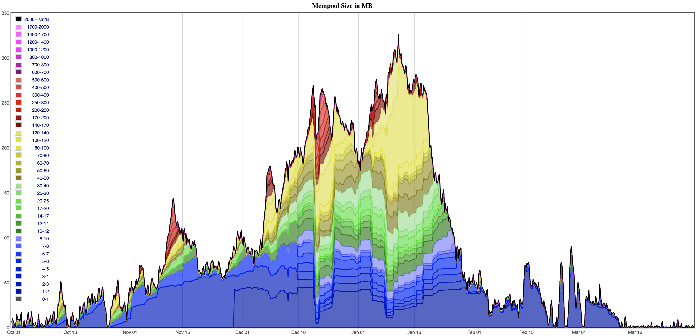

# Introduction to fee bumping

The fee market in Bitcoin can be very dynamic, with the fee-rate required for a
transaction to be included in a block increasing or decreasing rapidly.

*(Six months of mempool size, grouped by fee-rate, from https://jochen-hoenicke.de/queue/#1,24h)*

One of the reasons for the volatility in the fee-rate is that the mechanism
used to select what to include in a block is a market. In this market, the
miners supply 4Mweight of block space every ~10 minutes and users bid (through
transaction fees) to have their transaction included in a block. Different
wallets’ fee estimation algorithms are often naive and users are sometimes
insensitive to high fee-rates, which means that when the mempool grows to more
than a few megabytes and expected confirmation times start rising, a rapidly
escalating bidding war can ensue, with wallets attaching extremely high fees to
transactions.

This market has one strange quirk: if a user’s bid is unsuccessful and the
transaction isn’t included in a block, _the bid is not withdrawn_, and is still
valid for the next block. This is because transactions have an invariant
property that once they’re valid for inclusion in a block, then they will be
valid for inclusion in any subsequent block. In fact, the only way to
invalidate an already valid transaction (and thereby ‘withdraw’ that
transaction’s bid for block inclusion) is to spend its inputs in a conflicting
transaction.

This quirk generally isn’t a problem for users, since if a user signs a
transaction and they’re happy for it to be confirmed now, then presumably
they’d be happy for it to be confirmed at some point in the future for that
same fee-rate. However, there is one scenario in which the inability to
withdraw a transaction from the mempool can become a serious problem for users:
when the user has not attached a high enough fee-rate for the transaction to be
confirmed in a block, and the user has an urgent need for the transaction to be
confirmed. This could happen for many reasons: the wallet or user has
underestimated how much fee is required, the user has tried to save fees by
bidding at the low end of the fee estimation range, or the required fee rate
has just spiked unexpectedly after the transaction was broadcast. Whatever the
reason, the user finds themself with a transaction that is ‘stranded’ in the
mempool with a low fee rate, and a very low chance of being confirmed in future
blocks.

The risk of having a transaction getting stuck impedes on users’ leeway to
make low bids on transaction fees. If there is no way to get a transaction
unstuck after it’s been broadcast, then users are forced to bid conservatively
(high) to avoid the risk of having their transaction get stuck.

We therefore need a method to bump up the fee on an already broadcast
transaction for a couple of reasons:

1. To allow users to ‘unstick’ an already broadcast transction.
1. To give users the leeway to bid low on transaction fee-rate, with the
   option to later bump the fee up.

### The solutions

There are two common solutions for unsticking a payment that is stranded in the
mempool: Replace-by-fee (RBF) and Child Pays for Parent (CPFP):

##### Replace By Fee (RBF)

The user constructs and signs a replacement transaction which spends one or
more of the same inputs as the stuck transaction but pays additional fee
(usually by reducing the amount of bitcoin for the change output and leaving
the extra value as additional fee). If the replacement transaction attaches
enough fee, then miners will be incentivized to include it in a block.

##### Child Pays For Parent (CPFP) 

The user creates  a new transaction which spends one or more of the outputs of
the stuck transaction. This child transaction attaches a large fee - enough to
increase the combined fee-rate for itself and the stuck transaction above the
required fee-rate for inclusion in a block. Note that this is only possible
when the user owns some of the outputs

When selecting transactions for inclusion in a block, miners will consider
‘packages’ of transactions, and will look at the total fee-rate across the
entire package of ancestors and descendants. The miner is incentivized to do
this to maximize the total fee yield from the block.

This feature could rightly be called Descendants-Pay-For-Ancestors since the
mining code considers packages of up to 25 transactions in any length of chain. 

## User experience considerations

Fee bumping strategy has a very visible impact on user experience of a Bitcoin
wallet or service. Bitcoin services need to consider issues such as:

- Having no fee bumping strategy at all can lead to very poor user experience in
  cases where mempool fee-rates spike and a transaction becomes stuck
  indefinitely.
- Some services offer Service Level Agreements that guarantee confirmations
  within a certain number of blocks or within a certain time period. Failing to
  meet those SLAs leads to customer complaints and tickets.  (Whether such SLAs
  are realistic or desirable is outside the scope of this document!)
- Some Bitcoin wallets and services treat transactions that signal
  opt-in RBF differently from those that don’t (for example not showing RBF
  transactions in a user’s balance). This can be confusing for users sending from
  wallets that signal opt-in RBF. 
- Fee bumping with RBF creates a new transaction with a new txid. This can be
  confusing for users if they don’t understand that a payment’s txid/vout index
  will change when the transaction is RBF’ed.
- Fee bumping with RBF invalidates the signatures in the original transaction
  and requires all signers to re-sign. This is especially problematic for
  multisig transactions or where signing is done on a dedicated hardware wallet
  or HSM.
- By definition, fee bumping increases the fee attached to a transaction. For
  CPFP especially, the new fee can be significantly higher. Accounting for that
  fee and who pays it (the user or the service provider) can be difficult.

These issues will be discussed in more detail in later sections of this
document.

## Considerations for high volume users

There are additional considerations for entities that make heavy use of the
Bitcoin blockchain, such as exchanges or custodians:

- Services have a certain number of UTXOs in their hot wallet. If all of those
  UTXOs are tied up in stuck transactions, and the service’s wallet doesn’t use
  unconfirmed UTXOs as inputs, then they can run out of UTXOs for new
  transactions.
- Using opt-in RBF allows services to ‘low ball’ their initial fee-rate. If the
  transaction fails to confirm in the desired time, the fee can be bumped. For
  entities sending a lot of transactions, the savings in fee can be significant.
- Using CPFP to bump the fee can increase the total fee significantly, since
  the total fee has to pay for both the child and parent transactions - whereas
  an RBF transaction is replaced entirely and so doesn’t need to provide fee to
  cover an extra transaction. For entities sending a lot of transactions, the
  additional fees can be significant.
- Services that are very frequent spenders and broadcast transactions to the
  blockchain every block can chain together spends and use CPFP without any
  additional overhead (the transaction in a block pays for itself and the prior
  transaction).
- Services that use
  [payment batching](https://en.bitcoin.it/wiki/Techniques_to_reduce_transaction_fees#Payment_batching)
  effectively can bump many payments with a single RBF or CPFP.
- Services that are not using payment batching can use a large CPFP to bump
  multiple transactions at the same time, and potentially consolidate the UTXOs
  from those multiple transactions at the same time.
- The mempool code only allows transaction packages of up to 25 unconfirmed
  transactions (with a maximum weight of 404Kweight), so there’s a limit to the
  number of transactions that can be bumped with a single CPFP transaction.
- Services that have a coin selection algorithm that is effective at
  [change avoidance](https://en.bitcoin.it/wiki/Techniques_to_reduce_transaction_fees#Change_avoidance)
  will have many transactions without change outputs, which can’t be bumped using
  CPFP. Larger wallets are able to avoid change more often since they have a
  larger set of UTXOs to choose from.

These issues will be discussed in more detail in later sections of this document.

# Introduction to RBF

TODO

## Overview of what RBF is

TODO

## History of RBF

TODO

## BIP 125

TODO

### 5 conditions for RBF

TODO

## Interoperability & compatibility matrix

TODO

## Example of a company using RBF

TODO

# Introduction to CPFP

TODO

## Overview of how CPFP works

TODO

## History of CPFP (https://github.com/bitcoin/bitcoin/pull/7600)

TODO

## Example of a company using CPFP

TODO

# RBF or CPFP (or both)

TODO

## Advantages of RBF

TODO

## Advantages of CPFP

TODO

## Using both together

TODO

## Implementation gotchas

TODO

# Footnote: consensus, policy and incentive compatibility

Both solutions discussed in this article are related to network node and miner
behavior before a transaction is included in a block. That behavior is
therefore a question of policy rather than consensus. Both solutions are also
miner incentive-compatible - a miner who is trying to maximize his revenue will
accept both RBF’ed transactions and CPFP packages. Individual nodes’ mempools
(which should be a node’s best guess for what will be included in the next
blocks) should therefore also accept RBF’ed transactions and CPFP packages.
