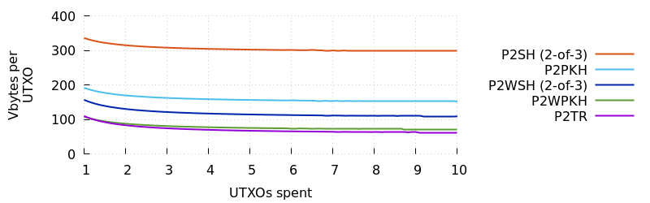

# UTXO Consolidation

Unspent Transaction Output (UTXO) consolidation is the act of taking the
bitcoin value stored in several UTXOs and *consolidating* it into one
UTXO.  This lowers the number of UTXOs you control while keeping your
balance roughly the same, increasing the chance that you'll be able to
create smaller and more affordable transactions at a later time when
you need to pay a higher feerate in order to obtain a fast confirmation.
As described in the following sections, most services that use
consolidation will save 20% to 40% on their overall transaction fees
without changing their payment user experience at all.  Outlier services
that receive significantly more incoming payments than they send
outgoing payments may save up to 80% through effective consolidation.

## A consolidation example

Imagine a transaction as a rectangle whose height is its feerate, whose
length is its size (block weight), and whose area is its total fee
(feerate times size).  For example, illustrated below is a simple
transaction that spends from one P2WPKH UTXO (input) to two P2WPKH
outputs---one output to a receiver and one as change back to the spender.

Most wallets eventually encounter a case where they don't have enough
value in a single UTXO to afford the amount they want to spend.  This
requires that they add more value to the transaction by spending
additional UTXOs.  For example, let's spend two extra P2WPKH UTXOs in
our example transaction:

Although that seemed like a minor change, it almost doubled the size and
cost of our transaction.  This is where consolidation can be useful.  By
preparing ahead, we can can *consolidate* the three UTXOs of our large
transaction into a single UTXO using a low-feerate transaction spent from
ourself to ourself.  Then we can pay the receiver using a single UTXO in a
high-feerate transaction that has an identical shape to the first
example transaction above:

Comparing the total costs, we find that the two transaction version is
40% cheaper than the single high-feerate transaction with three
UTXOs.  This is possible even though the two-transaction version uses
more total block space.

With consolidation, there's also no change to the user experience for
the receiver.  As long as you ensure your consolidation transactions
confirm before you try to spend their outputs, the payment to the
receiver will confirm at the same time whether or not you previously
consolidated your UTXOs (ignoring some rare corner cases).  <!-- corner
case: a post-consolidated single-input tx may sometimes confirm faster
than a non-consolidated multi-input tx because the smaller tx fits into
the lowest-feerate part of a block but the larger tx doesn't -->

## Average UTXOs spent

From the preceding example, we can see that spending is only
inefficient---and consolidation only useful---when there's a need to use
more than one UTXO in a transaction.  How often is that an issue for
you?  If you have access to the following two pieces of data, you can
use the simple equation provided below to estimate the average number of
UTXOs you use per transaction.

- `incoming`---the number of outputs your wallet has received from other
  people.

- `outgoing`---the number of transactions your wallet has created for
  spending bitcoins to other people.  If you use [payment batching][], note
  that this is the number of transactions and not the number of
  payments.  For increased precision, you may include in this total
  the number of transactions you'd expect to make until your wallet is
  empty (i.e. your current wallet balance divided by the average outgoing
  amount of your transactions).

To calculate your average number of UTXOs spent per transaction, use the
following equation:

    average_utxos = (incoming + outgoing) / outgoing

The reason that `outgoing` is on both sides of the divisor is because we
expect most transactions you create will also produce a change output
to return unspent value back to your wallet as a new UTXO.

The minimum realistic result of the equation above is 1.0, which is also
the minimum number of UTXOs that a transaction can include.  The further
above 1.0 your result is, the more you will benefit from UTXO
consolidation, as we'll see in the next section.

## Estimating savings

To estimate how much you can save using consolidation, let's look at how
the total fee of a typical transaction varies depending on how many
UTXOs it spends (i.e., how large it grows in size).  When reviewing this
chart, compare the x axis to the average number of UTXOs you computed in
the previous section.

What if we were able to consolidate all excess UTXOs into a single UTXO
using consolidation transactions that only paid 1/10th of the feerate
used in the preceding chart?  Then we could create regular spends at
the full feerate using just a single UTXO.  Overlaying this data on top
of the previous chart, we can see how much savings is possible:

Let's plot just the savings in percentage terms:

Obviously the actual amount we save is going to depend on the ratio
between the low/slow feerate used for consolidations and the high/fast feerate
used to pay receiver.  Using data provided in the appendix of this
chapter, the following ratios are commonly achievable as of this
writing:

Another thing that will affect the amount of our savings is how much
data we need to add to a transaction in order to spend each UTXO; that
is, the size of the transaction's input.  For P2WPKH, that's about 68
vbytes per UTXO; but for P2SH 2-of-3 multisig, it's about 294 vbytes.
Assuming we consolidate at 1/10th the feerate of regular spends, the
savings for various common script templates is:

Based on the above estimates, we expect that almost all active Bitcoin
services could save a significant amount of money on fees by using
consolidation at least some of the time.  The exception would be
services with a very low average number of UTXOs or those attempting
consolidation at time when the difference between fast (high) feerates
and slow (low) feerates is persistently small.

## UTXO pools

FIXME: move to after cold wallet section

The above examples assume that you'll go from having *n* UTXOs to having
just one UTXO, but that can create problems if you ever need to
broadcast a transaction while another one of your transactions is still
unconfirmed.

From the perspective of full nodes such as Bitcoin Core, UTXOs come in
two forms: confirmed and unconfirmed.  A confirmed UTXO is the output of
a transaction on the best block chain.  Most current nodes will always
accept the first-seen spend of confirmed UTXOs provided the spend is
valid, that it pays an appropriate feerate, that it is less than 100,000
vbytes, and that it follows a few other easy rules.  <!-- e.g., don't
use patterns reserved for future soft forks -->

An unconfirmed UTXO is the output of a transaction which is still in the
mempool (i.e. has not yet been confirmed).  To prevent DoS attacks
against node mempools, nodes place additional restrictions on
transactions that use unconfirmed UTXOs---such as not allowing them to
have more than 25 ancestors or for the size of all related transaction
in the mempool to exceed 100,000 vbytes.  That means you aren't
guaranteed to be able to spend unconfirmed UTXOs at an arbitrary time.
For example, a wallet may not be able to propagate the second
transaction illustrated below (tx1) until after the the first
transaction (tx0) has confirmed:

<!-- We pay three outputs in the first transaction so that we could
still make one unconfirmed output temporarily unspendable despite
second-child CPFP carve-out -->

               tx0                    tx1
               ---                    ---
    Wallet UTXO → Receiver Alice UTXO
                  Receiver Bob UTXO
                  Wallet UTXO (change) → Receiver Charlie UTXO
                                         Wallet UTXO (change)

Because many users expect to receive notification of new unconfirmed
transactions in their wallet within seconds of requesting a
payment---which requires nodes to immediately accept and relay those
transactions---many spenders don't want to find themselves in a position
of being unable to submit new transactions to the network while they
wait for one of their previous transactions to confirm.  This leads
those spenders to maintain a *UTXO pool*---a set of confirmed UTXOs that
are ready to be spent at any time.

UTXO pools don't significantly affect the savings described earlier
because you can always wait until later to consolidate the pool into a
single UTXO.  However, the more you split your funds between different
UTXOs to ensure instant spendability, the higher the chance that you'll
need to make a payment that exceeds the value of any single UTXO you
control---weakening, or possibly entirely eliminating, the fee savings
of UTXO consolidation.

If you rarely encounter that problem with your UTXO pool, you can
probably just ignore the few cases where it does happen as a minor
inefficiency.  If it happens frequently, you have several options:

1. Increase the average value of the outputs in your UTXO pool by
   keeping the number of outputs the same and increasing the value of
   each output, overall increasing the amount of money you have in the
   pool.  Note that this also increases the amount of money you'll lose
   due to theft or accident involving your wallet.

2. Increase the average value of the outputs in your UTXO pool by
   keeping the total amount the same but decreasing the number of
   outputs.  You can accomplish this by [batching payments][payment
   batching] to decrease the number of UTXOs you need at any particular
   time.

3. Focus on creating *changeless transactions* as described later in
   this chapter.  For the reasons described in that later subsection,
   changeless transactions usually aren't as efficient as consolidation,
   but they can save you some money.  When optimizing your UTXO pool for
   changeless transactions, you want your UTXOs to have a variety of
   amounts so you have as many different combinations of amounts as
   possible.

## Optimizing UTXO consolidations

To consolidate UTXOs, you need to include more data than just the UTXOs
in a transaction---you also have to include an output that pays the
funds back to yourself plus some transaction overhead (version
number, nLockTime, etc...).  The more UTXOs you consolidate in a single
transaction, the better the fixed costs of the transaction are divided
among UTXOs, with the cost per UTXO asymptotically approaching the
average size of one of your inputs.

As illustrated above, the savings from consolidating additional UTXOs at
the same time are not particularly large, so you can obtain reasonable
efficiency even if you pay no attention to consolidation size.

## Cold wallet consolidation

Some services, such as certain exchanges, have a basic division of
responsibilities between their wallets.  Incoming customer deposits or
payments are made to a cold wallet.  Outgoing payments or withdrawals
are made using a hot wallet.  As necessary, one or more staff members
transfers money from the cold wallet to the hot wallet.

A simple consolidation strategy is to take all the UTXOs received to the
cold wallet during a certain period (say a week) and consolidate them
together into a single UTXO.  However, you may wonder if this is wasteful
given that you may end up later splitting that single UTXO into several
UTXOs for your hot wallet's UTXO pool.  For example, if you consolidate
10 UTXOs into 1 UTXO, it seems inefficient to then transfer that back
into 5 UTXOs.

However, both of the alternatives may be worse.  The first alternative
is that you don't consolidate your cold wallet.  You simply wait until
you need to make a transfer to your hot wallet and perform the
consolidation then.  This minimizes the use of block chain space---but
all of that space is used in a single large transaction.  If you need
the transaction to confirm quickly---for example, because you need that
money to get to your hot wallet---you may end paying a high feerate for
that transaction and so lose out on the benefits of consolidating your
cold wallet.

The second alternative is to consolidate the 10 UTXOs to 5 UTXOs in your
cold wallet, then transfer the 5 cold UTXOS to 5 hot wallet UTXOs.  This
uses the most block space of the available options.  It creates a large
transaction at the low consolidation feerate plus a moderate-sized
transaction at the higher feerate used for sending to the hot wallet.
That makes this the worst performing option.

Although it seems a bit silly to maximally consolidate UTXOs and then
split them later, it's that simple consolidation strategy described at
the beginning of this section that can indeed provide the maximum savings.

## Privacy concerns

When you receive a payment to a new address that has never been used
before, analysts looking at block chain history won't know who owns that
UTXO.  But if you consolidate that UTXO with other UTXOs that they've
identified as belonging to you, the analysts can make the reasonable
assumption that all the consolidated funds belong to you.

    1 (Alice) \
               \
    2 (???)  -----> 6 (Alice)
               /
    3 (???) --/

For this reason, UTXO consolidation as described in this document should
not be used by users trying to maximize the privacy of their bitcoin
balance or transaction history.  It should especially be avoided by
users who have previously used techniques such as coinjoin to conflate
the ownership history of their UTXOs with other UTXOs.

It may be possible to perform a limited amount of consolidation during a
coinjoin, e.g. as implemented in Joinmarket or Wasabi.  Consolidation
even happens automatically using a [payjoin][].  Additionally,
ideas for future protocol development such as [channel factories][] or
[joinpools][] may make it more common for multiple UTXOs owned by
multiple people to be merged into a single UTXO and then used for
regular spends, making it less clear to analysts who owns the coins
resulting from a consolidation.

## Choosing UTXOs to consolidate

Your goal is to fulfill as many payments as possible using a single
UTXO, so you should consolidate your lowest-value UTXOs first, excluding
any UTXOs that aren't economical to spend.  Uneconomical UTXOs are those
that cost more to spend than the value they store.  For example, imagine
a P2PKH UTXO that holds 0.00001000 BTC; it costs about 148 vbytes to spend
a P2PKH UTXO, so if you multiply 148 by your per-vbyte feerate and get a
value over 0.00001000 BTC, you want to skip spending that UTXO at this
time.  You can re-evaluate spending it at a later time when feerates
have decreased.

Additionally,
you may be able to reduce your amount of privacy loss by ensuring that
any time you select a UTXO received to a particular address, you also
select all other UTXOs received to the same address.  For example,
imagine you want to consolidate three of the UTXOs in the example wallet
below:

| Outpoint | Received address  | Value (BTC) |
|----------|-------------------|-------------|
| abcdef:0 | bc1qfoo           | 0.1         |
| bcdefa:0 | bc1qbar           | 0.2         |
| cdefab:0 | bc1qfoo           | 0.3         |
| defabc:0 | bc1qbaz           | 0.4         |
| efabcd:0 | bc1qquux          | 0.5         |

You select `abcdef:0` because it's the lowest value UTXO.  You then
select `cdefab:0` because it was sent to the same address as `abcdef:0`.
Finally, you select `bcdefa:0` because it's the next lowest value UTXO.

For more information about selecting related UTXOs,
[read][avoidpartialspends] about the `-avoidpartialspend` configuration
option in Bitcoin Core.

## Consolidation versus competing techniques

There are some fee-saving techniques that can't be effectively used at
the same time you use UTXO consolidation, so the following subsections
compare them to consolidation, highlighting both their weaknesses and
their strengths.

### Changeless transactions

A changeless transaction doesn't include a change output, reducing the
size of the typical transaction by about 31 to 43 vbytes. <!-- P2WPKH vs
P2WSH -->  Although it's possible to create a changeless transaction
when spending only a single UTXO---which is the goal of
consolidating---you will often need to spend two or more UTXOs
simultaneously in order to be able to produce a changeless transaction.
That's because finding a changeless transaction is greatly helped by the
factorial number of UTXO combinations possible to include in a
transaction if you're willing to use an arbitrary number of inputs.

Changeless transactions save on both block space and fees, so they're
highly recommended.  However, efficient use of UTXO consolidation will
almost always save more money than changeless transactions that require
spending two or more UTXOs in the same transaction.  That's because
transaction inputs (UXTO spends) for all commonly-used scripts are
significantly larger than transaction outputs, so the savings of being
able to omit an output doesn't compensate for the cost of having to
include an extra input.

| Type            | Input vbytes | Output vbytes | Ratio |
|-----------------|--------------|---------------|-------|
| P2PKH           | 148          | 34            | 23%   |
| P2WPKH          | 68           | 31            | 46%   |
| 2-of-3 P2SH     | 294          | 32            | 11%   |
| 2-of-3 P2WSH    | 104          | 43            | 40%   |
| P2TR (proposed) | 57           | 43            | 75%   |

Changeless transactions also remove one UTXO from your wallet, reducing
your future fee burden in the same way UTXO consolidation does.  The
savings from this is harder to analyze because often you'll round up
your fee in order to create the changeless transaction, increasing your
spending feerate.  But even if we ignore that, inputs are so much larger
than outputs that consolidating at a reasonably low rate will still
save more money than creating two-input changeless transactions at a
higher spending feerate.  Consider an example: Alice and Bob each
receive 10 UTXOs.  Alice consolidates her UTXOs into a single UTXO at
1/10th a normal spending feerate and then sends five payments.  Bob
keeps his UTXOs separate and sends five payments of his own, each using
two UTXOs to create a changeless transaction at the normal spending
feerate:

Alice's Consolidation transaction with ten inputs and one output is
679.25 vbytes; her subsequent five payment transactions each with one
input and two outputs are 136.50 vbytes.  Bob's five changeless
transactions, each with two inputs and one output, are 169.25 vbytes in size.
If Alice and Bob both send their payment transactions at the same rate,
we can use some simple algebra to calculate what percentage of that
feerate Bob needs to use for his consolidation transaction in order to
save an equal amount of money as Alice saves using changeless
transactions:

    719.25 * x + 5 * 140.50 = 5 * 177.25
    x = 0.26 (rounded)

In short, if Alice can consolidate at a feerate of 1/4 of her regular
spending rate or lower, she'll save more money than Bob even though she
uses almost double as much block space as him.  The feerate data in the
appendix to this chapter indicates such savings are possible under our
rough assumptions over 96% of the time.

If Bob needed to use more than two inputs per transaction in order to create
a changeless transaction, Alice would be able to save more money even if she
used a correspondingly-higher feerate for her consolidation transaction.

That said, a clear advantage of changeless transactions over
consolidation transactions is that they allow the spender to save block
space and achieve modest fee savings while preserving their privacy
against the problems described in the *Privacy Concerns* section
above.  For most individual spenders or even small businesses who only
spend infrequently, that privacy advantage is more important to them than
the fee savings from consolidation.

## Predictive/Organic UTXO management

[Predictive UTXO management][] is a service provided by BitGo that
"reduces the overall cost by minimizing transaction sizes at high fee
rates, while automatically sweeping up and processing many small
fragments of coins when fees are low."  In other words, you
automatically perform consolidations as part of your regular spending
transactions when feerates are low, but stop consolidating when feerates
are high.  The exact implementation of
this technique is proprietary, but it's probably similar to [organic
UTXO consolidation][] as described by Dmitry Petukhov.

This class of techniques eliminates the extra block chain space used by
consolidation transactions, allowing it to possibly be more efficient
and save more on fees.  It may also be easier to implement for some
services, as it doesn't require waiting hours or days for consolidation
transactions to confirm.  Additionally, BitGo's predictive UTXO
management system in particular seems to achieve some of its savings
using the changeless transactions described in the previous section,
with the extra savings and privacy benefits described there.

However, when it comes to saving fees, UTXO consolidation will
frequently save more than predictive/organic techniques for spenders who
want their spending transactions to confirm within the next several blocks.
That's because saving a few dozen bytes in block chain space using
predictive/organic transactions doesn't match being able to save a large
percentage of UTXO spending costs by spending UTXOs at a lower feerate.
This was actually quantified in a earlier illustration:

For those that spend an average of two UTXOs or more per transaction
and who can consolidate at 50% or less of their normal feerate (and who
use the P2WPKH transactions analyzed here), consolidation at least
breaks even on costs and can easily save more money than sending a
normal transaction.  The feerate data included in the appendix to this
chapter shows that saving at least 50% on feerates for a nominal 2-block
confirmation target was possible 99.85% of the time during our analysis
period of November and December 2019.

Again, the predictive/organic method does have the advantage that it may
be significantly easier to implement than consolidation for existing
services, and combined with changeless transactions it may achieve a
modest additional savings plus boost privacy.  Still, spenders focused
on maximizing fee savings will probably want to focus on UTXO consolidation.

## Fee bumping

To maximize savings, consolidation transactions should be sent at the
lowest feerate that you believe will allow the transactions to confirm
before they are needed.  For example, if you can wait a week for a
transaction to confirm, you should use your fee estimator's target
feerate for confirmation within 1,008 blocks.

However, sometimes you may need to fee bump a previously-sent
consolidation transaction in order to make it confirm faster or because
feerates have risen unexpectedly.  In that case, you have several
options:

- For consolidations from a hot wallet to a hot wallet (or from a hot
  wallet to a cold wallet), you should signal [BIP125][] so that you can
  use Replace-by-Fee (RBF) fee bumping, which is the most efficient type of
  fee bumping.

- For consolidations sent from a cold wallet to a hot wallet, you can
  easily use Child-Pays-For-Parent (CPFP) fee bumping.

- For consolidations sent from a cold wallet to a cold wallet, you may
  want to design your transactions so that they always include a small
  output paid to your hot wallet.  This will allow you to use CPFP fee
  bumping via the hot wallet without needing to re-open the cold wallet.
  However, this extra output may slightly reduce the efficiency of your
  consolidation unless you were planning to transfer funds to your hot
  wallet anyway.

## Conclusion

For organizations that both frequently receive and frequently send
payments, consolidation is one of the most efficient ways to save money.
It's relatively easy to implement and, if done well, the people
receiving payments from you will never notice that you're doing it.

## See also

- [Field report: consolidation of 4 million UTXOs at Xapo][] by Anthony
  Towns

- [Presentation: unspent management and coin selection][] by Mark
  Erhardt

## Appendix A:

The following plot shows the estimated savings available over time
between using a 2-block confirmation target (~20 minutes) with Bitcoin
Core's fee estimation and a 1,008-block confirmation target (~1 week).

The table below summarizes how often it's possible to achieve a certain
rate of savings.  We see it's almost always possible to save 50% on
feerates by waiting a week and it's often possible to save 90% or more.

    | Savings | Percentage of time possible |
    | 50.00% | 99.85 |
    | 75.00% | 96.25 |
    | 90.00% | 87.35 |
    | 96.00% | 35.80 |
    | 98.00% | 1.45 |
    | 99.00% | 0 |

We use the one-week target above because that's the longest period
available with Bitcoin Core's estimator and because waiting a week for a
consolidation transaction to confirm is easy for many organizations.
Forthcoming chapters about feerate estimation and urgency tradeoffs will
provide a more detailed analysis of the differences in feerates between
different confirmation targets.

[avoidpartialspends]: https://bitcoinops.org/en/newsletters/2018/07/31/#bitcoin-core-12257
[Presentation: unspent management and coin selection]: https://www.youtube.com/watch?v=hrlNN3BSB6w&feature=emb_logo
[Field report: consolidation of 4 million UTXOs at xapo]: https://bitcoinops.org/en/xapo-utxo-consolidation/
[payment batching]: https://github.com/bitcoinops/scaling-book/blob/master/x.payment_batching/payment_batching.md
[channel factories]: https://bitcoinops.org/en/topics/channel-factories/
[joinpools]: https://freenode.irclog.whitequark.org/bitcoin-wizards/2019-05-21#24639483;
[BIP125]: https://github.com/bitcoin/bips/blob/master/bip-0125.mediawiki
[predictive utxo management]: https://www.businesswire.com/news/home/20180726005483/en/BitGo-Introduces-Predictive-UTXO-Management-Delivering-30
[organic utxo consolidation]: https://medium.com/simplexum/on-predictive-utxo-management-974be49506ca
[payjoin]: https://bitcoinops.org/en/topics/payjoin/
